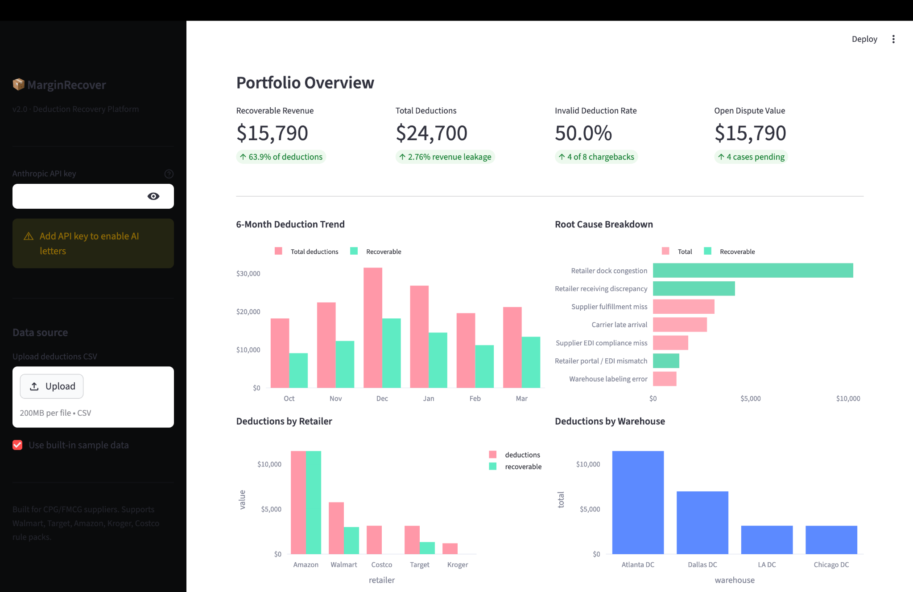
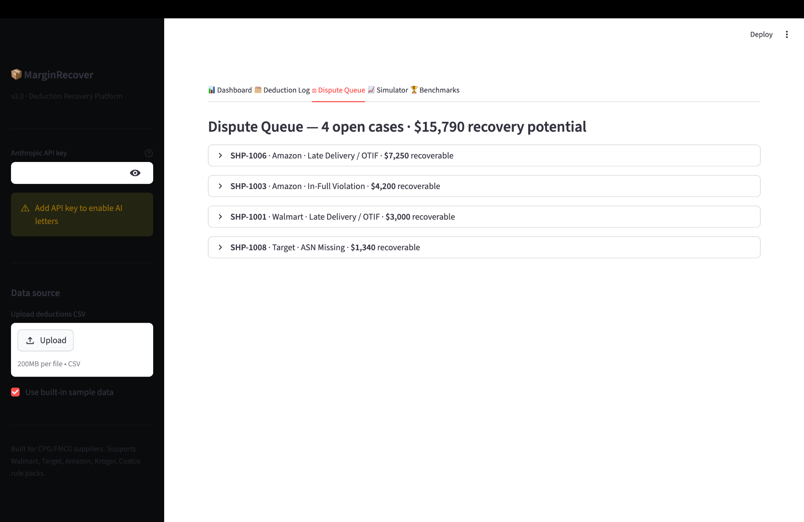
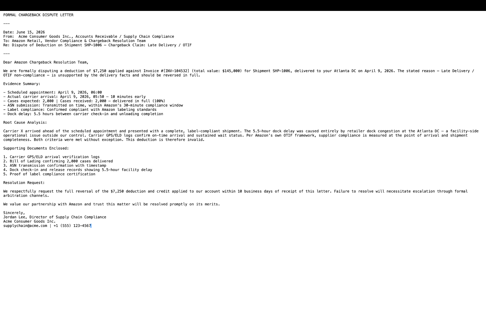

# MarginRecover


> Retailer deductions cost suppliers billions annually — most go undisputed because no one owns the process end-to-end.  
> MarginRecover identifies invalid chargebacks, prioritizes disputes, and automates recovery workflows.

## 🔗 Live Demo

[Open the app](https://marginrecover-6vmmmkfhv2ds5hokzqqetm.streamlit.app/)

---

## 🚀 Impact

- Identifies invalid deductions across major retailers (Amazon, Walmart, etc.)
- Prioritizes disputes based on recovery value and likelihood of success
- Automates claim documentation → reduces manual workload
- Provides visibility into revenue leakage across operations

📈 **Example (sample dataset):**
- $24,700 total deductions analyzed  
- $15,790 identified as recoverable  
- 4 high-priority disputes surfaced automatically  

---

## 🚀 Core Capabilities

- Rule-based deduction validation  
- Evidence-readiness scoring  
- Dispute prioritization pipeline  
- Automated dispute letter generation  
- Revenue impact simulation  

---

## 📊 Demo

### Portfolio Dashboard — Revenue leakage visibility


### Dispute Queue — Prioritized recovery pipeline


### AI Dispute Letter — Automated claim documentation


---

## 🧩 Business Problem

Retailer OTIF and compliance deductions often leak revenue because:

- Finance sees the short pay  
- Operations sees the shipment  
- No single owner drives dispute execution  

MarginRecover closes this gap by combining:

- Structured validation logic  
- Automated documentation  
- Decision support for recovery  

---

## 🛠 Tech Stack

- Python  
- Streamlit (frontend UI)  
- Pandas (data processing)  
- Rule-based validation engine  
- Modular architecture (data, rules, metrics, AI layers)  

## ▶️ Run locally

```bash
pip install -r requirements.txt
streamlit run app.py
```

---
## 🤖 Optional AI setup

If you want live AI summaries and dispute letters:

```bash
export ANTHROPIC_API_KEY="your_key_here"
```

Without an API key, the app still works using fallback logic.

---

## 📁 Repo structure

```text
marginrecover/
├── app.py
├── ai.py
├── charts.py
├── components.py
├── config.py
├── data.py
├── metrics.py
├── models.py
├── rules.py
├── requirements.txt
├── sample_data.csv
└── images/
    ├── dashboard.png
    ├── disputes.png
    └── letter.png
```

---

## 👤 Author

Giorgi Svanidze  
Chemical Engineering + Supply Chain @ Case Western Reserve University
